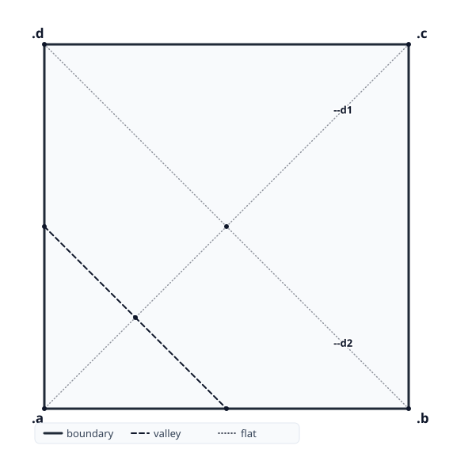
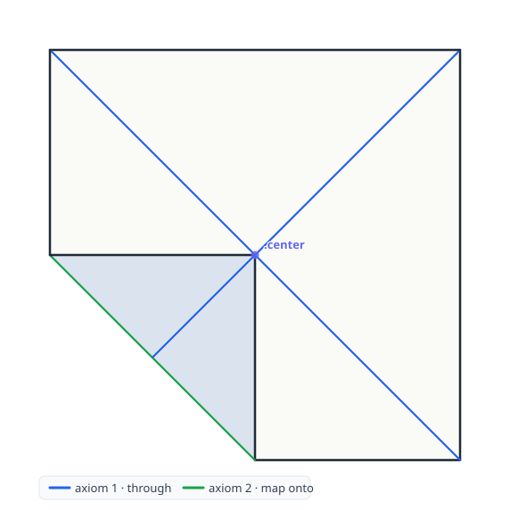

Beloch, named after [Margherita Piazzola Beloch][mpb], is a declarative language for origami, built on the [Huzita-Justin axioms][huzita-justin], that compiles source models into folded states, crease patterns, and step-by-step folding diagrams.

[mpb]: https://en.wikipedia.org/wiki/Margherita_Piazzola_Beloch
[huzita-justin]: https://langorigami.com/article/huzita-justin-axioms/

> **Status:** the evaluator implements all seven Huzita-Justin axioms over an
> exact real-algebraic number kernel and emits [FOLD][fold-spec]. See
> [`decisions/`](decisions/) for the architecture, [`spec/SPECIFICATION.md`](spec/SPECIFICATION.md)
> for the language, and [`notes/`](notes/) for the design journal. More at
> **[beloch.toph.so](https://beloch.toph.so)**.

[fold-spec]: https://github.com/edemaine/fold

## Quick example

```
paper square
--d1 = through .a .c
--d2 = through .b .d
.center = cross --d1 --d2
@map .a onto .center
```

Two diagonals, a named crossing, one fold — `@` actually folds `.a` onto
`.center` (a bare `map` would just mark the crease) along the crease axiom 2
derives. That program produces a [FOLD][fold-spec] file, which renders into
this — crease pattern and folded state, named constructions overlaid:

| crease pattern | folded |
| --- | --- |
|  |  |

More programs, from simple midline folds to Messer's cube-root-of-two
construction (axiom 7), are in [`examples/`](examples/).

## Development

The evaluator core is OCaml; tooling lives at the edges in TypeScript (see
[decision 0001](decisions/0001-ocaml-core-typescript-edge.md)). A Nix flake
provides the OCaml toolchain (dune, menhir, sedlex, ocaml-lsp, …):

```sh
direnv allow          # or: nix develop
dune build
dune exec beloch -- --version
```

## Layout

```
lib/          evaluator core (OCaml library)
bin/          the `beloch` CLI
spec/         human-readable language specification (grows per increment)
decisions/    architecture decision records (ADRs)
notes/        dated design journal
examples/     .bel programs, tagged works / aspirational / anti
paper/        the eventual write-up (arXiv / JOSS / OSME)
antipatterns.md  dead ends and rejected approaches
bibliography.md  annotated sources
```
