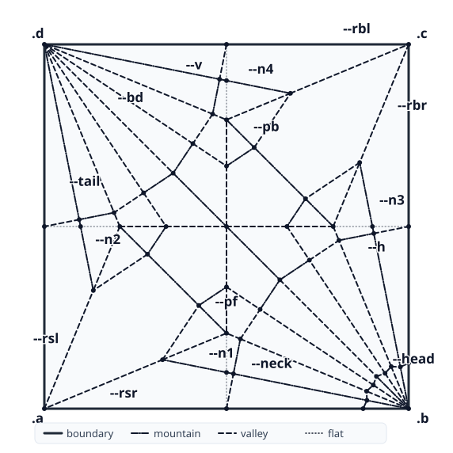
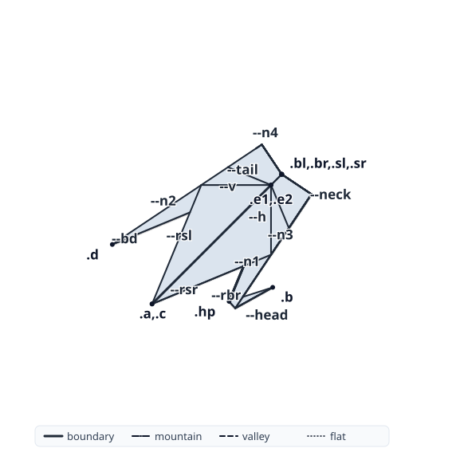
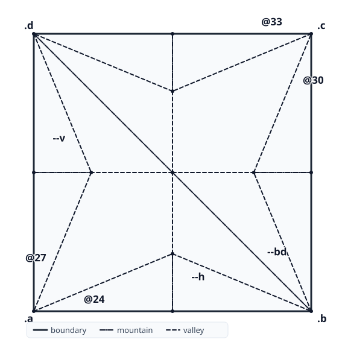

<p align="center">
  <picture>
    <source media="(prefers-color-scheme: dark)" srcset="packages/www/public/brand/mark-dark.svg">
    
  </picture>
</p>

<h1 align="center">beloch</h1>

<p align="center">
A declarative language for origami. A program names points and creases,
folds along constructions that align them, and evaluates to an exact folded
state, a crease pattern and a <a href="https://github.com/edemaine/fold">FOLD</a> file.
</p>

<p align="center">
<a href="https://beloch.toph.so/playground/"><b>Playground</b></a> ·
<a href="https://beloch.toph.so/language/">Language</a> ·
<a href="https://beloch.toph.so/model/">Model</a> ·
<a href="https://doi.org/10.5281/zenodo.22884252"></a>
</p>

| crease pattern | folded |
| --- | --- |
|  |  |

The traditional crane, flat, in sixteen statements:
[`examples/crane.bel`](examples/crane.bel). It follows steps 2 to 17 of Ida's
crane program [ida2020, Fig. 7.19]; her last two steps open the wings in 3D,
which Beloch does not model yet. The native evaluator folds it; the browser
playground cannot evaluate it yet.

## Reading a program

```
paper square

fold (map .a onto .c) as --bd           ; triangle: corner a onto corner c
reverse (map .b onto .c) as --h         ; corner b tucked inside, onto c
reverse (map .d onto .c) as --v         ; corner d likewise
```

That is the preliminary base
([`examples/bases/preliminary-reverse.bel`](examples/bases/preliminary-reverse.bel)).
`paper square` gives the unit square with corners `.a` `.b` `.c` `.d`
counter-clockwise from the origin. A name with a dot is a point, a name with
two dashes is a crease. `(map .a onto .c)` is the fold line that carries one
point onto another, one of the seven Huzita-Justin axioms; `as --bd` names the
crease so later statements can use it.

Five verbs write to the paper. `mark` scores a crease and moves nothing,
`fold` folds along it, `reverse` makes an inside or outside reverse fold,
`flip` turns the paper over, and `flatten` closes a vertex: given some of the
rays that meet there, it derives the crease that makes the vertex fold flat.
The evaluator works out where every layer goes and which creases end up
mountain or valley. The full grammar is in [`spec/BELOCH.md`](spec/BELOCH.md)
and on the [language page](https://beloch.toph.so/language/).

## What is new

A Beloch program is a finite sequence of Huzita-Justin constructions and
folds. The language has no loops, no recursion and no host language, so every
program terminates, and the statements of a program are its folding sequence
([decision 0009](decisions/0009-relationship-to-rabbit-ear.md)).

The evaluator computes the folded state in exact real-algebraic arithmetic
(FLINT `qqbar`), including the stacking order of the layers and the mountain
or valley assignment of each crease. A coincidence such as "this point lies on
this line" is decided exactly, and a √2 or an axiom-7 cube root stays exact
through every later fold.

`flatten` states a flat vertex by constraints on its rays and solves for the
crease that is missing. It expresses folds that no axiom constructs from the
points a program has named; the swivel rabbit ear below is one.

## Status

- **Implemented:** all seven axioms, the five verbs, FOLD output, crease
  pattern and folded-state rendering, a browser build. The programs in
  [`examples/`](examples/) evaluate end to end, up to the flat crane, and most
  of them carry assertions the test suite checks.
- **Formalised:** [`spec/MODEL.md`](spec/MODEL.md) defines folded states and
  the operations on them. Its first sections are reviewed; the section on
  operations is a draft, and two of its lemmas, among them that a fold
  introduces no crossing, have pending proofs.
- **Not yet:** Yoshizawa-Randlett folding diagrams, 3D states
  ([decision 0015](decisions/0015-flat-folded-states-only.md)), and
  measurements on programs longer than a few dozen statements.

## Related work

Written origami languages predate computers: Smith's Origami Instruction
Language [smith1975oil] is executed by a human folder. Fisher [fisher1994]
gave a textual folding language with its own syntax and a program that
executes it and tracks face layering. Ida's Eos [ida2009eos; ida2020] is the
most complete system. Its language Orikoto is a subset of the Wolfram Language
inside Mathematica; it folds by the Huzita-Justin rules, maintains the
superposition relation between faces, and proves constructions correct with
Gröbner bases, while the folds themselves are solved numerically
[ida2008entcs]. Caruana and Pace [caruana2007] embed the axioms in Haskell for
plane constructions and derive the preconditions a construction needs. eGami
[fastag2009egami] generates diagrams from direct manipulation. Rabbit Ear
[kraft-rabbitear] is a JavaScript library with the seven axioms as functions,
FOLD manipulation and folding simulation; a construction written with it is a
JavaScript program, and it reads the FOLD files Beloch emits.

Beloch combines what these hold separately: a standalone language that always
terminates, evaluated to its folded state in exact arithmetic. The citation
keys resolve in [`paper/references.bib`](paper/references.bib).

The write-up in [`paper/`](paper/) goes to programming-languages venues first
and to the computational-origami community at OSME (Origami Science,
Mathematics and Education) after.

## More programs

| | | |
| --- | --- | --- |
| [](examples/bases/bird-base.bel) | [](examples/bases/fish-base.bel) | [](examples/bases/swivel-rabbit.bel) |
| **Bird base**, seven statements, exact √2 coordinates | **Fish base**, closed with two `flatten`s | **Swivel rabbit ear**, whose fourth ray no axiom constructs |

<details>
<summary>The fish base program</summary>

```
paper square

mark (map .a onto .c) as --diag
mark (through .a .c) as --ray

mark (map --ab onto --diag) as --l1
mark (map --da onto --diag) as --l2
flatten (--l1) (--l2) (--ray) (toward .d)

mark (map --cd onto --diag) as --l3
mark (map --bc onto --diag) as --l4
flatten (--l3) (--l4) (--ray) (toward .d)
```


</details>

<details>
<summary>The swivel rabbit ear program</summary>

The hinges sit at a free height on the side edges. Three of the four rays at
the hinge vertex are given, flat-foldability forces the fourth, and `flatten`
solves for it and binds it to `--ear`. The scaffolding lines, prefixed `--_`,
locate the hinge height and stay flat.

```
paper square

mark (map .a onto .b) as --v      ; x = 1/2: spine, also the symmetry axis
.m = --v * --cd                   ; apex (1/2, 1)

mark (through .a .m) as --_am     ; scaffolding: locates the hinge height
mark (through .b .m) as --_bm
mark (map --ab onto --_am) as --_ba
mark (map --ab onto --_bm) as --_bb
.o = --_ba * --_bb

.lowerp = --_ba * --_bm
mark (perp --bc through .lowerp) as --lowerh

mark (through .a .[--bc --lowerh]) as --ba   ; hinge from a, free height
mark (through .b .[--da --lowerh]) as --bb   ; hinge from b, same height

flatten (--ba \ .a) (--bb \ .b) (--v \ .m) (toward .c) as --ear
```


</details>

Every drawing on this page is the renderer's output for the linked program.
`scripts/render-readme-figures.sh` redraws them, and CI fails when one no
longer matches its program.

## Running it

The [playground](https://beloch.toph.so/playground/) needs no install. It runs
the same evaluator, compiled to JavaScript with js_of_ocaml and backed by a
WebAssembly build of FLINT. An operation that forces a value the browser
backend cannot canonicalise says so and asks for the native evaluator; it
never returns a wrong answer.

With Nix, the evaluator runs without a checkout:

```sh
nix run github:tophcodes/beloch -- fold program.bel    # FOLD JSON on stdout
```

Rendering needs the development shell (below), which puts the renderer on
`PATH`:

```sh
beloch render examples/crane.bel crane.svg --view cp   # or --view folded
beloch render examples/crane.bel --open                # render and open it
```

<details>
<summary>What exact arithmetic costs</summary>

Exactness is paid for in evaluation time. Measured on the benchmark corpus
with `dune exec packages/core/bench/bench_fold.exe`, on one developer machine:

| program | time |
|---|---|
| fish base (√2 throughout) | 0.24 s |
| swivel rabbit ear | 0.13 s |
| rabbit ear | 0.13 s |
| two-ear fish | 0.24 s |
| cube root (axiom 7) | 0.13 s |

These are programs of ten to thirty statements. How the kernel behaves on
chained cubic folds, or on a crease pattern with hundreds of vertices, has not
been measured. The corpus is listed at the top of
`packages/core/bench/bench_fold.ml`.

</details>

## Citing

[`CITATION.cff`](CITATION.cff) holds the metadata, and GitHub's "Cite this
repository" button reads it. DOI:
[10.5281/zenodo.22884252](https://doi.org/10.5281/zenodo.22884252).

## Development

The evaluator core is OCaml, the tooling around it TypeScript. A Nix flake
provides both toolchains, so Nix and [direnv](https://direnv.net/) are the only
prerequisites:

```sh
direnv allow          # or: nix develop
check                 # every test suite
check-all             # what CI runs, adding docs, README drawings, site
```

The kernel suites have known failures, recorded with their cause in
`scripts/known-failures.txt`; a failure beyond them fails the check.

## Name

Beloch is named after [Margherita Piazzola Beloch][mpb], whose 1936 work
showed that folding solves general cubic equations. Axiom 7 is the Beloch
fold.

[mpb]: https://en.wikipedia.org/wiki/Margherita_Piazzola_Beloch

Licensed MIT ([`LICENSE.md`](LICENSE.md)).
