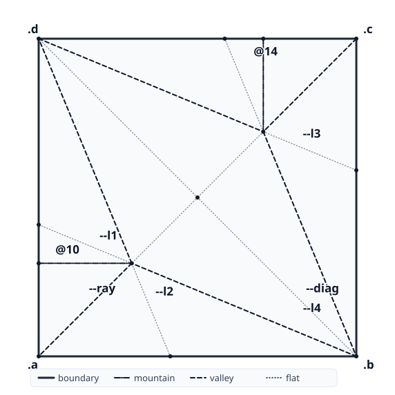
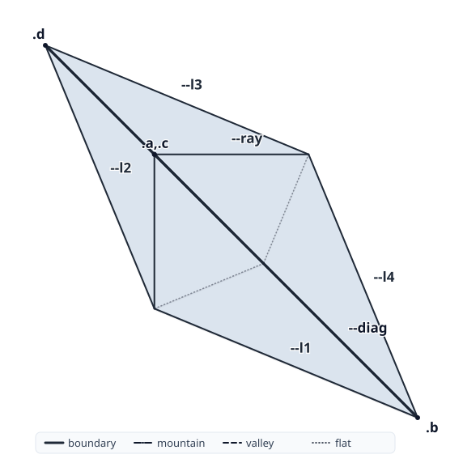
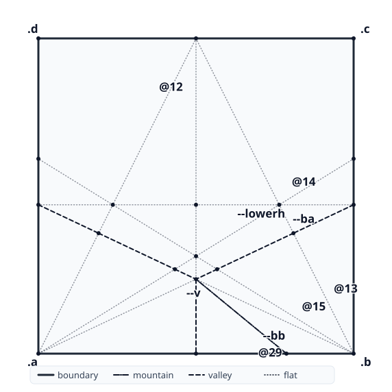
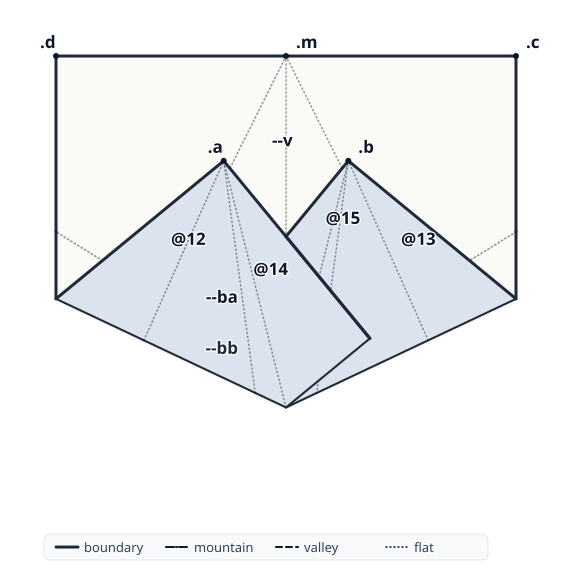

Beloch, named after [Margherita Piazzola Beloch][mpb], is a declarative language for origami, built on the [Huzita-Justin axioms][huzita-justin], that compiles source models into folded states, crease patterns, and step-by-step folding diagrams.

[mpb]: https://en.wikipedia.org/wiki/Margherita_Piazzola_Beloch
[huzita-justin]: https://langorigami.com/article/huzita-justin-axioms/

> **Status:** the evaluator implements all seven Huzita-Justin axioms over an
> exact real-algebraic number kernel and emits [FOLD][fold-spec]. See
> [`decisions/`](decisions/) for the architecture, [`spec/SPECIFICATION.md`](spec/SPECIFICATION.md)
> for the language, and [`notes/`](notes/) for the design journal. More at
> **[beloch.toph.so](https://beloch.toph.so)**.

[fold-spec]: https://github.com/edemaine/fold

## Bases

Two traditional bases, each a handful of statements. `mark` only scores a
crease, `fold` moves paper, and `flatten` collapses a vertex flat — deriving
the crease that closes it when no axiom can construct one. Every program emits
a [FOLD][fold-spec] file, which renders into the pairs below.

The crease pattern shows the sheet as it is folded: mountains and valleys are
derived from the layer order, and the construction lines that were only scored
stay flat.

### Fish base

Two long flaps from opposite corners. Each half of the diagonal is collapsed
with `flatten`, which derives the crease that closes the vertex — the one
crease here that no axiom constructs from the named points.

```
paper square

mark --diag = map .a onto .c
mark --ray = through .a .c

mark --l1 = map --ab onto --diag
mark --l2 = map --da onto --diag
flatten (--l1) (--l2) (--ray) {toward .d}

mark --l3 = map --cd onto --diag
mark --l4 = map --bc onto --diag
flatten (--l3) (--l4) (--ray) {toward .d}
```

| crease pattern | folded |
| --- | --- |
|  |  |

### Swivel rabbit ear

A rabbit ear whose hinges sit at a free height on the side edges rather than
at the triangle's angle bisectors, so the crease that flattens the vertex is
not constructible by any Huzita axiom from the named points — `flatten`
solves for it, and binds it to `--ear`:

```
--ear = flatten (--ba \ .a) (--bb \ .b) (--v \ .m) {toward .c}
```

| crease pattern | folded |
| --- | --- |
|  |  |

The full program, with the scaffolding that locates the hinge height, is in
[`examples/bases/swivel-rabbit.bel`](examples/bases/swivel-rabbit.bel). More
programs, from simple midline folds to Messer's cube-root-of-two construction
(axiom 7), are in [`examples/`](examples/).

## Development

The evaluator core is OCaml; tooling lives at the edges in TypeScript (see
[decision 0001](decisions/0001-ocaml-core-typescript-edge.md)). A Nix flake
provides the OCaml toolchain (dune, menhir, sedlex, ocaml-lsp, …):

```sh
direnv allow          # or: nix develop
dune build
dune exec beloch -- --version
```

## Layout

```
packages/core/      evaluator core + `beloch` CLI (OCaml)
packages/multifold/ multifold axiom enumeration (Alperin-Lang reproduction)
packages/render-2d/ FOLD→SVG render engine (bun)
packages/www/       landing + docs + Playground site
packages/eval-web/  js_of_ocaml browser eval bundle
packages/grammar/   tree-sitter grammar
packages/vscode/    editor extension
spec/         human-readable language specification (grows per increment)
decisions/    architecture decision records (ADRs)
notes/        dated design journal (+ antipatterns.md dead ends)
examples/     .bel programs, tagged works / aspirational / anti
paper/        the eventual write-up (arXiv / JOSS / OSME) + bibliography.md
```
