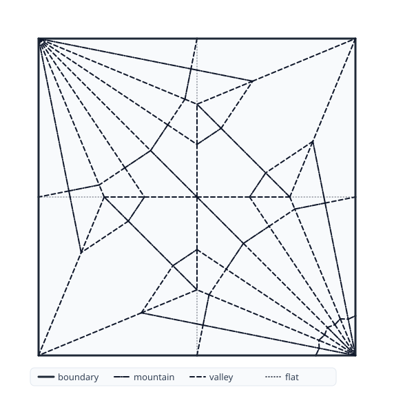
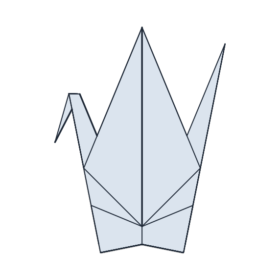
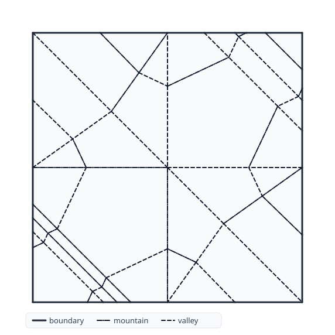
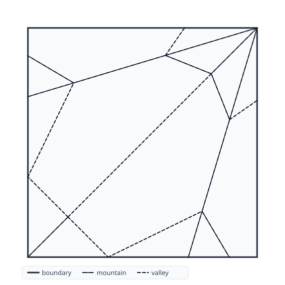
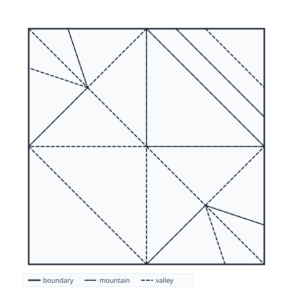
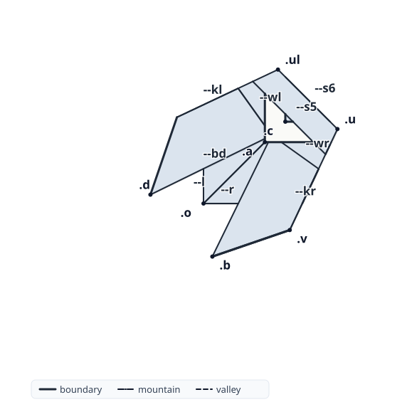
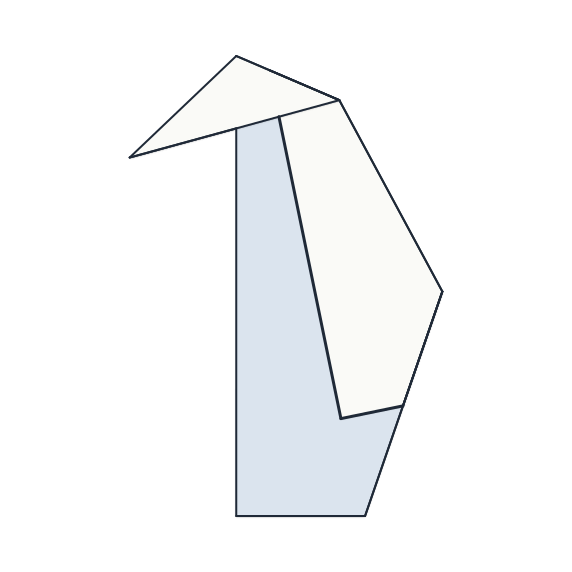
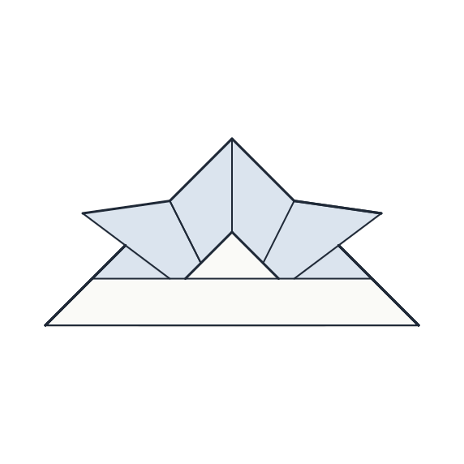

<p align="center">
  <picture>
    <source media="(prefers-color-scheme: dark)" srcset="packages/www/public/brand/mark-dark.svg">
    
  </picture>
</p>

<h1 align="center">beloch</h1>

<p align="center">
Origami folding sequences as programs. A program names points and creases and
folds along constructions that align them. Beloch evaluates it exactly, step by
step, into a <a href="https://github.com/edemaine/fold">FOLD</a> file, the
exchange format of computational-origami tools. Its own renderer draws crease
patterns and folded states from that file, and other FOLD tools can open it.
</p>

<p align="center">
<a href="https://belochlang.org/playground/"><b>Playground</b></a> ·
<a href="https://belochlang.org/language/">Language</a> ·
<a href="https://belochlang.org/model/">Model</a> ·
<a href="https://doi.org/10.5281/zenodo.22884252"></a>
</p>

| crease pattern | folded |
| --- | --- |
|  |  |

The traditional crane, flat, in 28 statements:
[`examples/crane.bel`](examples/crane.bel). It follows steps 2 to 17 of Ida's
crane program
([Ida 2020](https://doi.org/10.1007/978-3-319-59189-6), Fig. 7.19); her last
two steps open the wings in 3D, which Beloch does not model yet. The native
evaluator folds it; the browser playground cannot evaluate it yet.

## More programs

| | | |
| --- | --- | --- |
| [](examples/cicada.bel) | [](examples/penguin.bel) | [](examples/samurai-helmet.bel) |
| [](examples/cicada.bel) | [](examples/penguin.bel) | [](examples/samurai-helmet.bel) |
| **Cicada**, 26 statements: [`examples/cicada.bel`](examples/cicada.bel), after [Jimena Candia's diagram](https://origami.me/cicada/) | **Penguin**, 19 statements: [`examples/penguin.bel`](examples/penguin.bel), after [Kelly Tan's diagram](https://origami.me/penguin/) | **Samurai helmet**, 21 statements: [`examples/samurai-helmet.bel`](examples/samurai-helmet.bel), after [the diagram on origami.me](https://origami.me/samurai-helmet/) |

All three are traditional models, each folded to its last flat state after
a free diagram; the comments in a program name the diagram's steps.

Every drawing in this README is the renderer's output for the linked program.
`scripts/render-readme-figures.sh` redraws them, and CI fails when one no
longer matches its program.

## Reading a program

```
paper square

fold (map .a onto .c) as --bd           ; triangle: corner a onto corner c
reverse (map .b onto .c) as --h         ; corner b tucked inside, onto c
reverse (map .d onto .c) as --v         ; corner d likewise
```

These are the first three statements of the crane
([`examples/crane.bel`](examples/crane.bel)); they fold the preliminary base.
`paper square` gives the unit square with corners `.a` `.b` `.c` `.d`
counter-clockwise from the origin. A name with a dot is a point, a name with
two dashes is a crease. `(map .a onto .c)` is the fold line that carries one
point onto another, one of the seven Huzita-Justin axioms; `as --bd` names the
crease so later statements can use it.

Five verbs write to the paper. `mark` scores a crease and moves nothing,
`fold` folds along it, `reverse` makes an inside or outside reverse fold,
`flip` turns the paper over, and `flatten` folds a vertex flat along several
rays at once; given an odd number of them, it derives the one ray that is
missing. The evaluator works out where every layer goes and which creases end
up mountain or valley. The full grammar is in [`docs/reference/BELOCH-GRAMMAR.md`](docs/reference/BELOCH-GRAMMAR.md)
and on the [grammar page](https://belochlang.org/language/grammar/).

## Related work

Written origami languages predate computers: Smith's Origami Instruction
Language ([1975](#references)) is executed by a human folder. Fisher
([1994](#references)) gave a textual folding language with its own syntax and
a program that executes it and tracks face layering. Ida's Eos
([Ida et al. 2009](#references);
[Ida 2020](https://doi.org/10.1007/978-3-319-59189-6)) is the most comprehensive
system. Its language Orikoto is a subset of the Wolfram Language inside
Mathematica; it folds by the Huzita-Justin rules, maintains the superposition
relation between faces, and proves constructions correct with Gröbner bases,
while the folds themselves are solved numerically
([Ida et al. 2008](https://doi.org/10.1016/j.entcs.2008.06.032)). Caruana and
Pace ([2007](#references)) embed the axioms in Haskell for plane constructions
and derive the preconditions a construction needs. eGami
([Fastag 2009](#references)) generates diagrams from direct manipulation.
Rabbit Ear ([Kraft 2016](https://github.com/rabbit-ear/rabbit-ear)) is a
JavaScript library with the seven axioms as functions, FOLD manipulation and
folding simulation; a construction written with it is a JavaScript program,
and it reads the FOLD files Beloch emits.

Beloch combines what these hold separately: a standalone language that always
terminates, evaluated to its folded state in exact arithmetic.

## What is new

The evaluator computes the folded state of a folding sequence in exact
real-algebraic arithmetic (FLINT `qqbar`): where every layer lies, the stacking
order of the layers, and which creases end up mountain or valley. A coincidence
such as "this corner lies on this crease" is decided, and a √2 from axiom 5 or
the cube root of axiom 7 stays exact through every later fold. Fisher's
executor places lines near vertices by tolerance and Eos solves each fold
numerically; here the question is decided exactly.

`flatten` folds a vertex flat along several rays at once. Given an odd number
of rays, it derives the ray that Kawasaki's condition forces and scores it as
a new crease. This expresses folds no Huzita-Justin axiom constructs from the
points a program has named; the swivel rabbit ear
([`packages/core/tests/cases/bases/swivel-rabbit.bel`](packages/core/tests/cases/bases/swivel-rabbit.bel))
is one.

Both rest on the language: a program is a finite sequence of constructions and
folds, with no loops, no recursion (a `def` sees only earlier `def`s) and no
host language
([decision 0009](docs/decisions/20260628-relationship-to-rabbit-ear.md)). Every program
terminates, its statements are its folding sequence, and every crease in the
FOLD output names the statement and the construction that made it.

## Status

- **Implemented:** all seven axioms, the five verbs, FOLD output, crease
  pattern and folded-state rendering, a browser build. Four traditional
  models in [`examples/`](examples/) evaluate end to end to their last flat
  state, and the test suite checks assertions on them. Programs for the
  jumping frog, the flapping bird and the traditional frog are drafts; each
  stops at a step the kernel cannot fold yet.
- **Formalized:** [`docs/reference/MODEL.md`](docs/reference/MODEL.md) defines folded states and
  the operations on them. Its first sections are reviewed; the section on
  operations is a draft, and two of its lemmas, among them that a fold
  introduces no crossing, have pending proofs.
- **Not yet:** Yoshizawa-Randlett folding diagrams, 3D states
  ([decision 0015](docs/decisions/20260703-flat-folded-states-only.md)), and
  measurements on programs longer than a few dozen statements.

## Running it

The [playground](https://belochlang.org/playground/) needs no install. It runs
the same evaluator, compiled to JavaScript with js_of_ocaml and backed by a
WebAssembly build of FLINT. An operation that forces a value the browser
backend cannot canonicalize says so and asks for the native evaluator; it
never returns a wrong answer.

With Nix, the evaluator runs without a checkout:

```sh
nix run github:tophcodes/beloch -- fold program.bel    # FOLD JSON on stdout
```

Rendering needs the development shell (below), which puts the renderer on
`PATH`:

```sh
beloch render examples/crane.bel crane.svg --view cp   # or --view folded
beloch render examples/crane.bel --open                # render and open it
```

<details>
<summary>What exact arithmetic costs</summary>

Exactness is paid for in evaluation time. Measured on the benchmark corpus
with `dune exec packages/core/bench/bench_fold.exe`, on one developer machine:

| program | time |
|---|---|
| fish base (√2 throughout) | 0.24 s |
| swivel rabbit ear | 0.13 s |
| rabbit ear | 0.13 s |
| two-ear fish | 0.24 s |
| cube root (axiom 7) | 0.13 s |

These are programs of ten to thirty statements. How the kernel behaves on
chained cubic folds, or on a crease pattern with hundreds of vertices, has not
been measured. The corpus is listed at the top of
`packages/core/bench/bench_fold.ml`.

</details>

## Development

The evaluator core is OCaml, the tooling around it TypeScript. A Nix flake
provides both toolchains, so Nix and [direnv](https://direnv.net/) are the only
prerequisites:

```sh
direnv allow          # or: nix develop
check                 # every test suite
check-all             # what CI runs, adding docs, README drawings, site
```

The kernel suites have known failures, recorded with their cause in
`scripts/known-failures.txt`; a failure beyond them fails the check.

## References

- Caruana, G. and Pace, G. J. (2007). Embedded Languages for Origami-Based
  Geometry. *Proceedings of the Computer Science Annual Workshop (CSAW)*,
  University of Malta.
- Fastag, J. (2009). eGami: Virtual Paperfolding and Diagramming Software. In
  R. J. Lang (ed.), *Origami⁴*, A K Peters, 273–283.
- Fisher, D. (1994). *Origami On Computer*. Honours thesis, Basser Department
  of Computer Science, University of Sydney.
- Ida, T. (2020). *An Introduction to Computational Origami*. Springer.
  [doi:10.1007/978-3-319-59189-6](https://doi.org/10.1007/978-3-319-59189-6)
- Ida, T., Marin, M., Takahashi, H. and Ghourabi, F. (2008). Computational
  Origami Construction as Constraint Solving and Rewriting. *Electronic Notes
  in Theoretical Computer Science* 216, 31–44.
  [doi:10.1016/j.entcs.2008.06.032](https://doi.org/10.1016/j.entcs.2008.06.032)
- Ida, T., Takahashi, H., Marin, M., Kasem, A. and Ghourabi, F. (2009).
  Computational Origami System Eos. In R. J. Lang (ed.), *Origami⁴*,
  A K Peters, 285–293.
- Kraft, R. (2016–). *Rabbit Ear*, a computational origami library.
  [github.com/rabbit-ear/rabbit-ear](https://github.com/rabbit-ear/rabbit-ear)
- Smith, J. S. (1975). *Origami Instruction Language*. British Origami Society
  Booklet No. 4.

BibTeX for all of them is in [`bibliography/references.bib`](bibliography/references.bib).

## Citing

```bibtex
@software{muehl_beloch,
  author  = {M{\"u}hl, Christopher},
  title   = {Beloch: origami folding sequences as programs},
  year    = {2026},
  doi     = {10.5281/zenodo.22884252},
  url     = {https://github.com/tophcodes/beloch}
}
```

GitHub's "Cite this repository" button offers the same entry and APA, read
from [`CITATION.cff`](CITATION.cff).

## Name

Beloch is named after [Margherita Piazzola Beloch][mpb], whose 1936 work
showed that folding solves general cubic equations. Axiom 7 is the Beloch
fold.

[mpb]: https://en.wikipedia.org/wiki/Margherita_Piazzola_Beloch

Licensed MIT ([`LICENSE.md`](LICENSE.md)).
